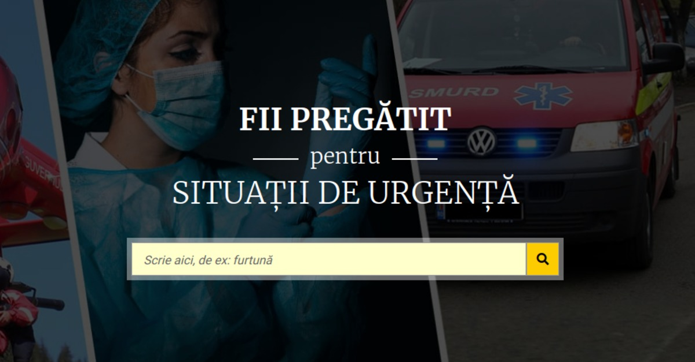

   

# [fiipregătit.ro](https://fiipregatit.ro)
Platforma Națională de Pregătire pentru Situații de Urgență

Soluția propusă a fost dezvoltată în strânsă colaborare cu specialiștii DSU și cuprinde următoarele funcționalități:

- O serie de ghiduri informative pentru situații de urgență (cutremur, avalanșă, etc.)
- Un plan personal detaliat cu recomandări pentru situații de supraviețuire
- Informații utile pentru cele mai comune cazuri de urgență și prim-ajutor
- Prezentarea campaniilor DSU derulate de-a lungul timpului în mass-media
- CMS WordPress personalizat pentru administrarea conținutului

Mai multe informații pe [civicnet.ro](https://civicnet.ro/)

## Contribuie

Dacă vrei să contribui - ești binevenit(ă) - but we don't have cookies (yet) 

### Pull Requests > Issues
Preferă pull request-uri peste issues unde e posibil, pull request-urile sunt primite cu brațele deschise oricând.  

### Cum poți intra in contact cu echipa?
- Deschide un issue nou, marcat cu label `question`
- Sau contactează-ne prin oricare dintre modalitățile disponibile [pe civicnet.ro](https://civicnet.ro/contact)

----------

	 
	 
	 
  

    Made with :heart: and :coffee: by
  

  
   

